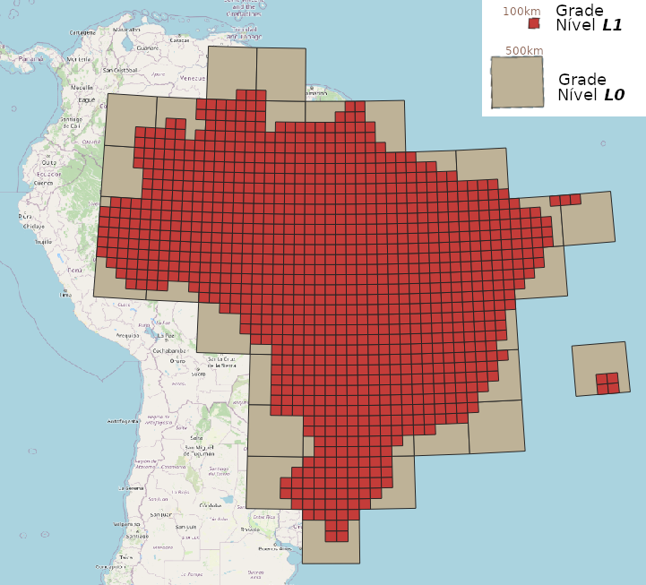
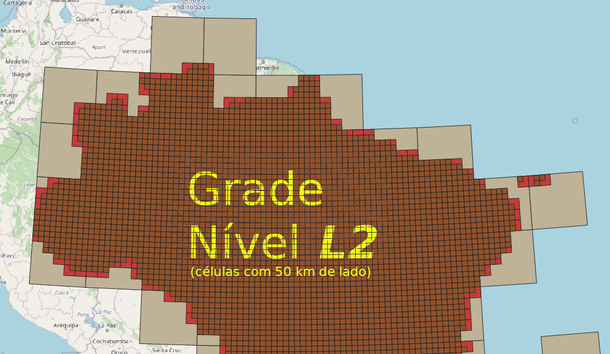

# Grade Estatística IBGE em Representação Compacta


Sumário:

* [CONVENÇÕES DO IBGE](#convenções-do-ibge)
    * [Estrutura das tabelas](#estrutura-das-tabelas)
    * [Nomenclatura das células](#nomenclatura-das-células)
* [DECISÕES DE PROJETO](#decisões-de-projeto)    
* [ALGORITMOS IMPLANTADOS](#algoritmos-implantados)
    * [Resolução dos identificadores de célula](#resolução-dos-identificadores-de-célula)
    * [Resolução de ponto em célula](#resolução-de-ponto-em-célula)
    * [Adaptações para outros países](#adaptações-para-outros-países)
* [API](#api)
* [INSTALAÇÃO, COMPATIBILIDADE, BIBLIOTECA, ETC](#instalação,-compatibilidade,-biblioteca,-etc)
* [DISTRIBUIÇÃO DA GRADE COMPACTA](#distribuição-da-grade-compacta)

ATALHOS PARA A DISTRIBUIÇÃO DOS DADOS:

* _Download_ da Grade Compacta: [grid_ibge_censo2010_info.zip](https://github.com/osm-codes/BR_IBGE/raw/main/data/grid_ibge_censo2010_info.zip)
* _Download_ da última versão estável deste repositório: ver [releases](https://github.com/osm-codes/BR_IBGE/releases).

------------

O presente projeto oferece *scripts* para redistribuir mais eficientremente a Grade Estatística oficial do IBGE, e para aprimorar seu uso em bancos de dados. Resultou em uma versão otimizada, com os mesmos dados, porém viabilizando novas aplicações.

O principal objetivo foi oferecer uma **estrutura de dados alternativa** à estrutura original, batizada de **Grade Estatística IBGE Compacta**, com as seguintes **vantagens**: <!-- O principal objetivo destes *scripts* é oferecer uma **estrutura de dados alternativa** à estrutura original dos *shapfiles* de grade IBGE, com as seguintes **vantagens**:-->

1. **reduzir o tamanho da distribuição** da geometria da grade, de 849&nbsp;Mb (56 arquivos zip) para um só arquivo zip de 44&nbsp;Mb (**5%**&nbsp;dos&nbsp;849). **Disponível [aqui como `grid_ibge_censo2010_info.zip`](data/grid_ibge_censo2010_info.zip)**.

2. **estruturar de forma mais simples**, capaz de reproduzir funcionalmente os dados estrutura originais, e capaz ainda de ser utilizada:  

   2.1. **em qualquer banco de dados SQL simples** (por ex. [SQLite](https://en.wikipedia.org/wiki/SQLite)), sem necessidade de extensões GIS ou geometria.

   2.2. **no [PostGIS](https://en.wikipedia.org/wiki/PostGIS)** com as mesmas (ou mais) aplicações que a distribuição original. <br/>Em paricular **otimizar** os algoritmos de "resolução dos identificadores de célula" (*encode/decode*), e de posição espacial em identificador de célula.

3. **reduzir a ocupação em disco no banco de dados SQL** (a 20% ou menos do tamanho original).

4. **distribuir em formato mais aberto** (não-proprietário) e mais simples e interoperável do que o [Shapefile](https://en.wikipedia.org/wiki/Shapefile): o formato [CSV](https://en.wikipedia.org/wiki/Comma-separated_values) é legível até por planilha (ex. Excel) e é um padrão aberto universal.

# CONVENÇÕES DO IBGE

Em janeiro de 2016 o IBGE publicou mais formalmente a sua Grade Estatística em [grade_estatistica/censo_2010](https://geoftp.ibge.gov.br/recortes_para_fins_estatisticos/grade_estatistica/censo_2010/), do site `IBGE.gov.br`, onde podemos acessar livremente o [documento de justificativas](https://geoftp.ibge.gov.br/recortes_para_fins_estatisticos/grade_estatistica/censo_2010/grade_estatistica.pdf) (que infelizmente não pode ser utilizado como referência técnica) e os arquivos da geometria da grade em *shapfile*.

Se você nunca havia antes ouvido falar, veja o [filminho didáco sobre ela](https://www.youtube.com/watch?v=s5yrDV_c2-4), ou explore o Censo 2010 através da [grade *online*](https://mapasinterativos.ibge.gov.br/grade/default.html) (ilustração abaixo).


 A "grade" do IBGE é na verdade um **conjunto hierarquizado de grades** (ou _"grid system"_), aparentemente seguindo as recomendações [INSPIRE *D2.8.I.2*](https://inspire.ec.europa.eu/documents/Data_Specifications/INSPIRE_DataSpecification_GG_v3.1.pdf), "Data Specification on Geographical Grid Systems – Technical Guidelines" de 2014, ou anterior.

Cada quadrante da grade IBGE  de menor escala (na [ilustração do sumário](#grade-estatística-ibge-em-representação-compacta) a grade nível *L0*) é subdividio em quadrados com lado medindo 1/5 ou 1/2 do seu tamanho para formar a grade seguinte, de menor escala e maior resolução.
A grade seguinte à *L0*, a *L1*, tem quadrados com 500/5&nbsp;km&nbsp;=&nbsp;100&nbsp;km de lado; a seguinte *L2* com 100/2&nbsp;km&nbsp;=&nbsp;50&nbsp;km; *L3* com 50/5&nbsp;km&nbsp;=&nbsp;10&nbsp;km; *L4* com 10/2&nbsp;km&nbsp;=&nbsp;5&nbsp;km; *L6* com 5/5&nbsp;km&nbsp;=&nbsp;**1&nbsp;km**.

Na distribuição da gemetria das grades de 200m e 1km foram acrescentados **dados relevantes do Censo de 2010**.
A seguir a descrição dessa grade mesclada aos dados. Dada a precariedade da documentação, **algumas dúvidas permanecem**, e outras foram deduzidas por reengenharia, também descrita a seguir.

## Estrutura das tabelas

Todas as tabelas criadas pelos *shapfiles* originais do IBGE (vide ) possuem a estrutura:

Column   |            Type             | Comments                 
----------|----------------------------|---------
`gid`        | integer                     | ID de tabelas de geometria, gerado por antigo padrão.<br/>Nota: é otimizável como indexador porém redundante com `id_unico`.
`id_unico`   | character varying(50)       | ID real da célula. String do tipo `{lado}E{X}N{Y}`, com referência XY na projeção Albers.
`nome_1km`   | character varying(16)       | (redundante) Apoio na agregação de 1 km.
`nome_5km`   | character varying(16)       | (redundante) Apoio na agregação de 5 km.
`nome_10km`  | character varying(16)       | (redundante) Apoio na agregação de 10 km.
`nome_50km`  | character varying(16)       | (redundante) Apoio na agregação de 50 km.
`nome_100km` | character varying(16)       | (redundante) Apoio na agregação de 100 km.
`nome_500km` | character varying(16)       | (redundante) Apoio na agregação de 500 km.
`quadrante`  | character varying(50)       | (redundante) Localiza o quadrante ou apoia a agregação de 500 km.
`masc`       | integer                     | população do sexo masculino
`fem`        | integer                     | população do sexo feminino
`pop`        | integer                     | população total (conforme Censo 2010) no interior da célula
`dom_ocu`    | integer                     | domicílios ocupados - particulares permanentes, particulares improvisados e coletivos (todos as categorias da V4001 - Espécie no Censo Demográfico 2010).
`shape_leng` | numeric                     | (redundante)
`shape_area` | numeric                     | (redundante)
`geom`       | geometry(MultiPolygon,4326) | geometria da célula em coordenadas LatLong WGS84 (sem projeção)

## Nomenclatura das células

Em qualquer quadrante *qq* o resultado de `SELECT DISTINCT substr(id_unico,1,4) id_prefix FROM grade_IDqq` será o conjunto
{"1KME",&nbsp;"200M"}. Isso significa que todos os demais atributos `nome_*` (e `quadrante`) da estrutura acima, são reduntantes. Só existem esses dois tipos de célula, sendo a menor delas, 200 m, usada para o meio urbano, onde se faz necessária uma cobertura mais densa. No caso das células com `id_prefix` "1KME", de 1 km de lado, teremos `id_unico=nome_1km`.

Quanto ao signiicado do valor de `id_unico`, que segue a *URI Template* `{lado}E{X}N{Y}`, onde `lado` é o tamanho do lado da célula, `X` e `Y` as "coordenadas da célula" tendo como referência o seu canto... Qual canto?
Tomando como referência as coordenadas do centro da geometria (função PostGIS `ST_Centroid`)
percebemos que o IBGE não adotou uma convenção regular: para células de 1 km basta truncar ou usar o canto inferior direito,
mas para células de 200 metros é o canto superior direito.

```SQL
SELECT * FROM (
  SELECT is_200m, id_unico_parts,
       round( ST_x(ST_Transform(geom,952019)) + iif(is_200m,-100,-500) )::int x,
       round( ST_y(ST_Transform(geom,952019)) + iif(is_200m,+100,-500) )::int y
  FROM (
    SELECT substr(id_unico,1,4)='200M' AS is_200m,
      CASE
        WHEN id_unico=nome_1km THEN array[substr(id_unico,5,4), substr(id_unico,10)]
        ELSE  array[substr(id_unico,6,5), substr(id_unico,12)]
        END id_unico_parts,
      ST_centroid(st_transform(geom,952019)) as geom
    FROM grade_id45
  ) t1
) t2 -- WHERE homologando a heuristica da nomenclatura das células:
WHERE substr(x::text,1,length(id_unico_parts[1]))!=id_unico_parts[1]
   OR substr(y::text,1,length(id_unico_parts[2]))!=id_unico_parts[2]
ORDER BY 1;
```
O algoritmo foi validado contra células de 200m (flag `is_200m`) e 1km. conforme `id_unico`.  Para as células de 200m foram validadas as coordenadas "X_centro-100" e "Y_centro+100", para células de 1km as coordenadas "X_centro-500" e "Y_centro-500".

A mesma heuristca pode ser utilizada para a recuperação de dados a partir do identificador IBGE das células de 200 m e de 1 km. A generalização para células maiores (10 km, 50 km etc.) requer uma avaliação mais detalhada, a seguir.

# DECISÕES DE PROJETO

Mesmo sendo uma reprodução fiel e completa da grade original, alinhada aos [objetivos](#grade-estatística-ibge-em-representação-compacta) apresentados acima, algumas decisões são arbitrárias e se tornam convenções, que não podem ser revisadas depois de homologada a proposta:

* Níveis hierárquicos numerados de 0 a 6: zero é o quadrante de origem, 1 a 6 são os níveis de subdivisão.

* Informação embutida no *gid* de 64 bits: porém **codificação decimal**, para debug e legibilidade humana. Apenas a operação *bitwise* `gid&7` retornando o nível hierárquico, um valor que varia de 0 a 7 no último dígito decimal (3 bits).

* Uso do *nome original* da célula presente no *gid*:  mera conversão de string em bigint, mantendo em decimal a mesma legibilidade para humanos.

* Uso do *centro da célula* nos mecanismos de busca: uniformiza a operação e mantém, nos algoritmos otimizados, a tradição das demais bibliotecas de geocódigo indexador, como Geohash binário, S2geometry e outras.

* Valores `fem` e `masc` arredondados: por serem antigos e mais imprecisos que `pop`, não nos preocupamos com a precisão em arredondamentos.

# ALGORITMOS IMPLANTADOS

Os scripts possuem duas finalidades:

1. Popular uma base de dados PostgreSQL **com as tabelas dos _shapefiles_ originais** da distribuição IBGE.

2. Criar e popular com os dados originais uma nova estrutura, **mais compacta** e eficiente para a **indexação de outros dados** e a **resolução dos identificadores de célula**.

Na [seção INSTALAÇÃO](#instalação) abaixo, descreve-se como cada uma dessas estruturas de dados pode ser intaladas com um simples comando com o número da alternativa (1 ou 2).

A seguir a descrição dos algoritmos que geram a conversão da grade original em compacta, e vice-versa, que transformam a compacta em original, e outros recursos.

## Estrutura compacta

Com rótulo e geometria compactados em um simples inteiro de 64 bits (*bigint* no PostgreSQL), e eliminando outras redundâncias, as informações da grade original podem ser transferidas, sem perdas, para a seguinte estrutura:

Column         |   Type   | Comments
---------------|----------|--------------
`gid`          | bigint  NOT NULL PRIMARY KEY | "Geometric IDentifier" com informação embutida (4 bits do nível da grade e ~60 bits para o ponto XY de referência da célula)
`pop`          | integer  NOT NULL| população total dentro da célula.
`pop_fem_perc` | smallint NOT NULL| percentual da população feminina
`dom_ocu`      | smallint NOT NULL| domicílios ocupados

O codificador de coordenadas consegue compactar toda a informação de localização do ponto de referência da célula em um só número inteiro de 64 bits através de operações *bitwise* e aritméticas decimais.

...

Como os valores mínimo e máximo das coordenadas XY dos centros de célula de todo o conjunto são, respectivamente, `(2809500,7599500)` e `(7620500,11920500)`, duas ordens de grandeza abaixo de `2^30-1 = 1073741823`. Cabem folgadamente em 30 bits e ainda sobram 3 bits para codificar o nível hierárquico da grade na qual se encontra o ponto. A representação final para os 64 bits do *gid*  proposto é a seguinte, em três partes:

* **7 primeiros dígitos**, posições 1 a 7: valor no eixo *X* da projeção Albers.
* **8 dígitos seguintes**, posições 8 a 16: valor no eixo *Y* da projeção Albers.
* **Úlimo dígito**: número do nível hierárquico da célula, seguindo a convenção *L0*=500KM, *L1*=100KM, ..., *L5*=1KM, *L6*=200M.

Por exemplo, o valor do `gid` da célula de 200M que contém o [Marco Zero de São Paulo](https://pt.wikipedia.org/wiki/Marco_zero_da_cidade_de_S%C3%A3o_Paulo) é *5756000087008006*, portanto *X=5756000*, *Y=08700800* e *L=6*.

Com isso podemos podemos indexar além das células fornecidas pelos shapfiles do IBGE, todas as demais, criando um grande e econômico _cache_ das grades de sumarização.

## Visualização dos identificadores

Na biblioteca são oferecidas funções geradoras da geometria da célula, **não há necessidade de se armazenar a geometria da célula**. As funções, principalmente aquela que toma como argumento apenas o *gid*, são simples e rápidas o bastante no PostGIS. No QGIS um grande número de células podem ser vistas simultaneamente através de uma VIEW SQL, sem cache. Por exemplo a grade *L1* inteira:

```sql
CREATE VIEW test_grade_level1 AS
  SELECT gid, grid_ibge.draw_cell(gid) geom
  FROM grid_ibge.censo2010_info
  WHERE grid_ibge.gid_to_level(gid)=1;
```

Abaixo ilustradas as grades *L0* e *L1*  com respectivamente células de lado 500KM e 100KM, em seguida um zoom para destacar a VIEW da grade *L2* de 50KM.





## Resolução dos identificadores de célula

...

## Resolução de ponto em célula

A solução proposta na presente versão indexada por XY permite usar a representação interna invez da busca geométrica.
Por exemplo o ponto XY=(4580490.89,8849499.5) pode primeiramente ser arredondado para inteiros multiplicados por 10, e
em seguida a busca se realizaria através de indexão otimizada em cada coordenada, nas tabelas `mvw_censo2010_info_Xsearch` e `mvw_censo2010_info_Ysearch`.

...

## Adaptações para outros países

Conforme necessidades, os _scripts_ SQL podem ser facilmente adaptados, desde que refatorando nos diversos scripts. As adaptações mais comuns são:

* SRID da projeção Albers do IBGE: mude o valor 952019 para o valor desejado.

* Uso do *SQL schema* `public` (sem *schema*) no lugar de : basta eliminar os comandos DROP SCHEMA e CREATE SCHEMA correspondentes, e alterar todas as ocorrências de `grid_ibge.` para `public.`.

* Discarte do preparo: a operação de `DROP CASCADE` pode ser comentada caso esteja realizando testes, fazendo por partes, ou reusando o *schema* em outras partes do seu sistema.

## API
As funções de resolução para uso na API são descritas no README do `/src`. Com devidas configurações no NGINX elas se tornam os seguintes _endpoints_:

* ... osm.org/geo:br_ibge2010:{nome} ou {gid}  .. idem osm.org/geo:br_cep:04569010  por hora retorna CRP. ou busca br_crp mas
* Endpoint `br_ibge.osm.org/{cell_id}`:  retorna célula solicitada na sintaxe original,  por exemplo `5KME5300N9630`.
* Endpoint `br_ibge.osm.org/geo:{lat},{long}`:  efeua `search_cell(p_x,p_y,5)`, ou seja, retorna célula de 1km.
* Endpoint `br_ibge.osm.org/geo:{lat},{long};u={uncertainty}`: usa a incerteza para deduzir o nível mais próximo e efeuar `search_cell(p_x,p_y,p_level)`. Por exemplo erro de 5km a 10km retorna células de 10 km.
* ...  

Exemplos de busca a serem implementadas no futuro:

... tabela de exemplos com pontos conhecidos (Wikidata) do Brasil.

----------------

## INSTALAÇÃO, COMPATIBILIDADE, BIBLIOTECA, ETC

Documentação para demais detalhes, ver [`/src/README.md`](src/README.md):

* [SRC/INTRODUÇÃO](src/README.md#introdução)

* [SRC/BIBLIOTECA](src/README.md#biblioteca)
    * Uso geral
    * Interação API PostgREST

* [SRC/INSTALAÇÃO](src/README.md#instalação)
    * Instalando somente o zip
    * Reproduzindo o processo completo
    * Compatibilidade
    * Script NGINX

------

## DISTRIBUIÇÃO DA GRADE COMPACTA

Na pasta `/data` temos:
* [grid_ibge_censo2010_info.zip](data/grid_ibge_censo2010_info.zip): grade compacta CSV zipada.
* [md5sum.txt](data/md5sum.txt) e [sha256sum.txt](data/sha256sum.txt): checksums dos dados-fonte originais IBGE, e da grade compacta.
* [quadrantes.geojson](data/quadrantes.geojson): geometria do nível *L0* com  contornos dos níveis *L5* e *L6*.

Resumo das **metas alcançadas pelo projeto**:

* Arquivo CSV: `grid_ibge_censo2010_info.csv` tem ~340&nbsp;Mb, que zipado resulta em **47&nbsp;Mb** (14% de 339Mb).
  - *reduziu o tamanho da distribuição* (de 849&nbsp;Mb) para **6%**.
  - *simplificou a estrutura*: o CSV é muito mais simples, legível, aberto e universal do que *shapfiles*.
* *Otimizadada para SQL*: o uso do identificador de célula como indexador tornou muito mais ágeis as funções de conversão, garantem o uso nas aplicações estatísticas e de recuperação da informação.  
* *Otimizada para PostGIS e similares*: a biblioteca de reconstrução geométria é rápida e na maior parte das aplicações dispensa o cache de geometria.
* *Reduziu a ocupação em disco no banco de dados SQL*: de ~4112&nbsp;MB (13286489&nbsp;linhas e ~325&nbsp;bytes/linha) para ~17%=693&nbsp;MB   (13924454&nbsp;linhas e ~52&nbsp;bytes/linha).
