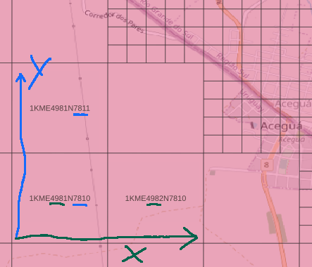
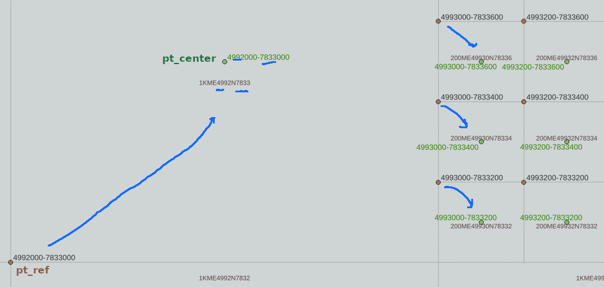
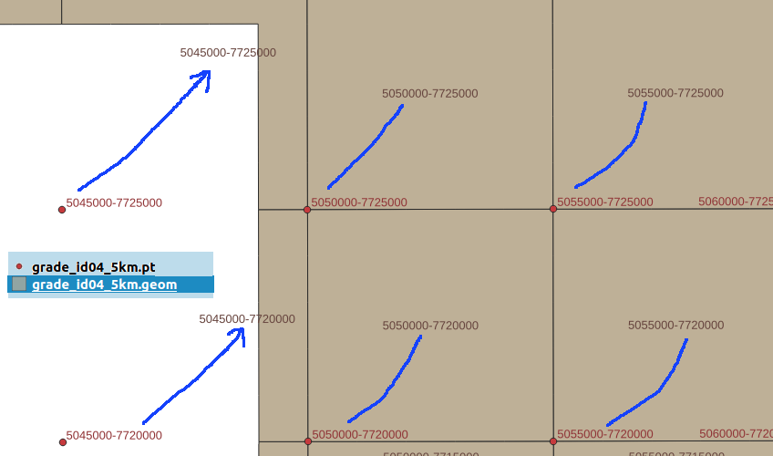

## Códigos-fonte SQL e make

* [INTRODUÇÃO](#introdução)

* [BIBLIOTECA](#biblioteca)
    * Uso geral
    * Interação PostgREST

* [INSTALAÇÃO](#instalação)
    * [Instalando somente o zip](#instalando-somente-o-zip)
    * [Reproduzindo o processo completo](#reproduzindo-o-processo-completo)

-----

## INTRODUÇÃO

Como a decisão de projeto foi reusar os nomes das células como pontos de referência, precisamos primeiramente entender a relação entre os pontos e os nomes. A consulta SQL abaixo nos auxilia nessa empreitada didática e de reengencharia:

```sql
-- Depois de rodar step2 apenas.
DROP TABLE IF EXISTS grade_id04_teste1;
CREATE TABLE grade_id04_teste1 AS
 SELECT gid, p[2]||'-'||p[3] AS nome,
        ST_SetSRID( ST_MakePoint(p[2],p[3]),952019) pt_ref,
        ST_SetSRID( ST_MakePoint(c[1],c[2]),952019) pt_center,
        grid_ibge.draw_cell( c[1], c[2], CASE WHEN p[1]=6 THEN 100 ELSE 500 END) AS geom
 FROM (
  SELECT grid_ibge.name_to_gid(id_unico) as gid,
         grid_ibge.name_to_parts_normalized(id_unico) p,
         grid_ibge.name_to_center(id_unico) c,
         geom2 as geom
  FROM (SELECT *, st_transform(geom,952019) as geom2  FROM grade_id04 ) t1
 ) t2
 LIMIT 29000
; -- pode resuzir LIMIT, é só para visualizar algo no Sul do Brasil com QGIS
```

Para entender melhor a direção dos eixos _X_ e _Y_ na representação usual das coordenadas _XY_ Albers, e na coluna `nome_xy`, podemos visualizar apenas um pequeno trecho com os pontos de `grade_id04` no QGIS:



Os pontos de referência de nome `id_unico` do IBGE (*pt_ref*), nas grades 1KM e 200M, tem sua localização indicada abaixo, quando visualizamos a tabela original `grade_id04` sobreposta a esta `grade_id04_pts` no QGIS:



A seta azul indica o deslozamente necessário para ir de *pt_ref* para *pt_center* específicos de cada célula.
Como células de 200M e 1KM coexistem no mesmo conjunto de dados, o IBGE parece ter optado pelo deslocamento no ponto de referência das células de 200M,  para evidar confusão com os pontos das de 1KM.

Por fim, podemos confirmar no QGIS que da grade de 5KM em diante (10KM, 50KM, etc.), todas as grades de sumarização (_ST_Union_ do _script_ abaixo) seguem a referência no canto inferior esquerdo, como na de 1KM.




```SQL
-- Query de sumarização em células 5KM:
DROP TABLE IF EXISTS grade_id04_5km;
CREATE TABLE grade_id04_5km AS
 SELECT gid, p[2]||'-'||p[3] AS pt, n,
        ST_SetSRID( ST_MakePoint(p[2],p[3]),952019) pt_geom,
        geom -- bordas da união dos componentes (células 5KM parciais)
 FROM (
  SELECT grid_ibge.name_to_gid(nome_5km) as gid, n,
         grid_ibge.name_to_parts_normalized(nome_5km) p,
         geom
  FROM (
    SELECT nome_5km, COUNT(*) n,
           ST_UNion( ST_simplify(geom,0.00001) ) as geom
    FROM grade_id04
    GROUP BY nome_5km
  ) t1
 ) t2;
```

Desta evidência final do comportamento dos pontos de referência chegamos à função que coloca pontos de referência (oriundos ne `id_unico`, `nome_1km`, `nome_5km`, etc.) no centro da célula:

```SQL
CREATE FUNCTION grid_ibge.name_to_center(name text) RETURNS int[] AS $f$
  SELECT CASE
    WHEN L=6 THEN array[ x_ref+halfside, y_ref-halfside ]
    ELSE          array[ x_ref+halfside, y_ref+halfside ]
    END
  FROM (
    SELECT p[1] as L, p[2] as x_ref, p[3] as y_ref,
           grid_ibge.level_to_size(p[1])/2::int as halfside
    FROM ( SELECT grid_ibge.name_to_parts_normalized(name) p ) t1
  ) t2
$f$ LANGUAGE SQL IMMUTABLE;
```

## BIBLIOTECA

Principais funções em [`step4_prepareGridLibs.sql`](step4_prepareGridLibs.sql), para a manipulação da grade compacta e conversão entre as representações original e compacta, todas do SQL SCHEMA `grid_ibge`:

* `coordinate_encode(x real, y real, level int)`: compacta as coordenadas XY Albers de centro de célula em *gid*, com respectivo nível da célula.

* `coordinate_encode10(x10 int, y10 int, level int)`: faz o trabalho para `coordinate_encode()`, já que internamente a representação é por inteiros XY10.

* `coordinate_decode10(gid bigint)`: retorna centro XY10 e nível da célula identificada por *gid*.

* `level_decode(gid bigint)`: devolve apenas o nível da célula identificada por *gid*.

* `level_to_size(level int)`: devolve o tamanho de lado da célula conforme a convenção de níveis (0 a 6) adotada.   

* `search_xy10(p_x10 int, p_y10 int, p_level smallint)`: descobre a célula onde está contido o ponto XY10, por hora preparando para rodar apenas com p_level=5.

* `search_cell(p_x real, p_y real, p_level smallint)`: idem `search_xy10()` porém partindo das coordenadas XY Albers.

* `draw_cell(gid bigint)`: desenha célula identificada por *gid*.

<!--
* grid_ibge.coordinate_encode10:
* grid_ibge.coordinate_encode(x real, y real, level int)
* grid_ibge.coordinate_encode(x real, y real, is_200m boolean)
* grid_ibge.coordinate_encode(x real, y real)
* grid_ibge.coordinate_encode10(x10 int, y10 int, level int)
* grid_ibge.coordinate_decode10(gid bigint)
* grid_ibge.level_decode(gid bigint) RETURNS int AS $f$
* grid_ibge.level_to_size(level int)  
* grid_ibge.search_xy10(p_x10 int, p_y10 int, p_level smallint)
* grid_ibge.search_cell(p_x real, p_y real, p_level smallint)
* grid_ibge.xy10_to_quadrante()
* grid_ibge.xy_to_quadrante()
* grid_ibge.gid_to_quadrante(p_gid bigint)
* grid_ibge.draw_cell(real,real,int,boolean,int)
* grid_ibge.draw_cell(int,int,int,boolean,int)
* grid_ibge.draw_cell(int[],int,boolean,int)
* grid_ibge.draw_cell(bigint,boolean,int)
-->

### API
Funções de resolução para uso na API.

* ...
* Endpoint `br_ibge.osm.org/{cell_id}`:  retorna célula solicitada na sintaxe original,  por exemplo `5KME5300N9630`.
* Endpoint `br_ibge.osm.org/geo:{lat},{long}`:  efeua `search_cell(p_x,p_y,5)`, ou seja, retorna célula de 1km.
* Endpoint `br_ibge.osm.org/geo:{lat},{long};u={uncertainty}`: usa a incerteza para deduzir o nível mais próximo e efeuar `search_cell(p_x,p_y,p_level)`. Por exemplo erro de 5km a 10km retorna células de 10 km.
* ...  

## INSTALAÇÃO

Use no terminal, a parir desta pasta, o comando `make` para listar as alternativas de instalação integral (*all1* ou *all2* descritas abaixo), que rodam todos os  _targets_ necessários, exceto `clean`. O comando `make` sem target informa também o que fazem os demais targets, que podem ser executados em separado.

Na pasta anterior, em [/src/README.md](../README.md), as versões e configurações necessárias são detalhadas.

### Instalando somente o zip
Recomenda-se o mais simples, que é obter a **Grade Estatística IBGE Compacta** diretamente a partir do CSV zipado desta distribuição git. Basta executar, em terminal Linux:

```sh
make all2
```

### Reproduzindo o processo completo

Se o objetivo for reproduzir, auditorar ou atualizar a  partir da **Grade Estatística IBGE Original**, demora um pouco mais e requer um pouco mais de espaço em disco, mas é igualmente simples. Basta executar no terminal Linux, nesta pasta, o comando:

```sh
make all1
```

Ou executar, na sequência, cada um dos _targets_ definidos nas dependências de *all1*.
No final de `make grid_orig_get` (ou meio do `make all1`) todas as tabelas de quadrantes,  `grade_id*`, terão sido criadas:
```
 grade_id04: 66031 itens inseridos
 grade_id13: 31126 itens inseridos
 grade_id14: 537732 itens inseridos
 grade_id15: 306162 itens inseridos
 ...
 grade_id92: 5091 itens inseridos
 grade_id93: 1901 itens inseridos
(56 rows)
```

Executando em seguida o `make grid_alt1_fromOrig` (final do `make all1`), as tabelas são lidas e as geometrias de célula são convertidas em coordenadas de centro (na função `grid_ibge.censo2010_info_load()`), para formar o identificador de célula com representação binária compacta (representado em *bigint*) na tabela `grid_ibge.censo2010_info`.  O resultado será resumido pela comparação:

resource            | tables | tot_bytes  | tot_size | tot_lines | bytes_per_line
--------------------|--------|------------|----------|-----------|-----------
Grade IBGE original |     56 | 4311826432 | 4112 MB  |  13286489 |            325
Grade compacta      |      1 |  726556672 | 693 MB   |  13924454 |             52

nível | núm. células
------|----------------
0 |              56
1 |            1000
2 |            3802
3 |           90624
4 |          358069
5 |         8860553
6 |         4610350

<!-- old Grade compacta      |      1 |  693272576 | 661 MB   |  13286489 |         52 -->
A tabela da nova grade pode ainda ser gravada como CSV,  

```sql
COPY grid_ibge.censo2010_info TO '/tmp/grid_ibge_censo2010_info.csv' CSV HEADER;
```
Se por acaso o IBGE gerar uma nova versão da grade original, o arquivo CSV deve então ser zipado com o comando `zip` Linux e gravado no presente repositório *git*, na pasta [/data/BR_IBGE](https://github.com/AddressForAll/grid-tests/tree/main/data/BR_IBGE).

### Compatibilidade

Use `make` na pasta `/src`  para ver instruções e rodar _targets_ desejados.
O software foi testado com as seguintes versões e configurações:

* PostgreSQL v12 ou v13, e PostGIS v3. Disponível em *localhost* como service. Rodar make com outra `pg_uri` se o usuário não for *postgres*

* `psql` v13. Configurado no `makefile` para rodar já autenticado pelo usuário do terminal .

* pastas *default*: rodar o `make` a partir da própria pasta *git*, `/src/BR_new`. Geração de arquivos pelo servidor local PostgreSQL em `/tmp/pg_io`.

Para testes pode-se usar `git clone https://git.osm.codes/BR_IBGE.git` ou uma versão específica zipada, por exemplo `wget -c https://git.osm.codes/BR_IBGE/archive/refs/tags/`. Em seguida, estes seriam os procedimentos básicos para rodar o *make* em terminal *bash*, por exemplo:
```sh
cd grid-tests/src/BR_new
make
```

O `make` sem target vai apnas listar as opções. Para rodar um target específico usar `make nomeTarget`.
Para rodar com outra base ou outra URI de conexão com PostreSQL server, usar por exemplo <br/>`make db=outraBase pg_uri=outraConexao nomeTarget`.
