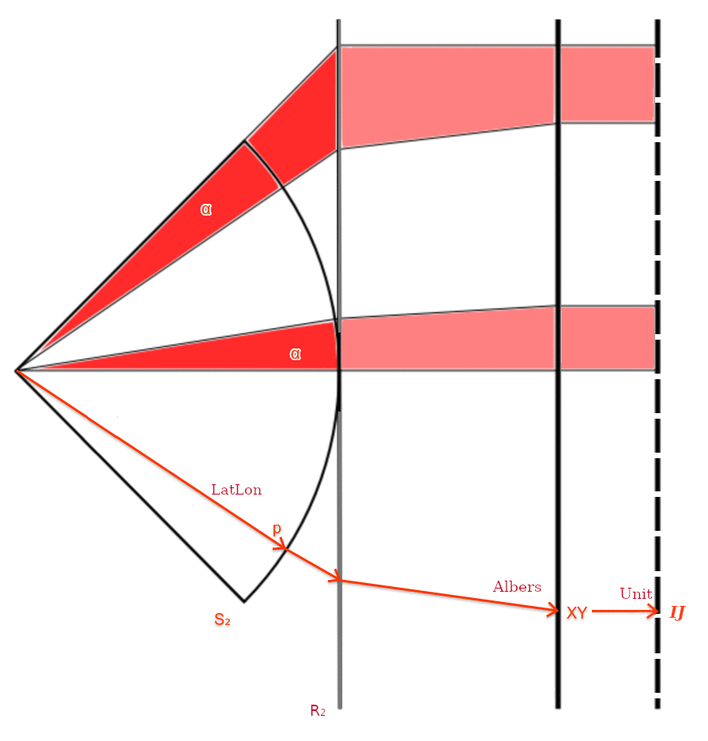

## Códigos-fonte SQL e make

* [INTRODUÇÃO](#introdução)

    * Controle sintático
    * Sistemas de coordenadas padronizados
* [ARQUIVOS STEP](#arquivos-step)
* [BIBLIOTECA](#biblioteca-principal)
    * Uso geral
    * Interação PostgREST

* [INSTALAÇÃO](#instalação)
    * [Instalando somente o zip](#instalando-somente-o-zip)
    * [Reproduzindo o processo completo](#reproduzindo-o-processo-completo)
    * Compatibilidade
    * Homologação

-----

## INTRODUÇÃO

Como a decisão de projeto foi reusar os nomes das células como pontos de referência, precisamos primeiramente entender a relação entre os pontos e os nomes. A consulta SQL abaixo nos auxilia nessa empreitada didática e de reengencharia:

```sql
-- Depois de rodar step2 apenas.
DROP TABLE IF EXISTS grade_id04_teste1;
CREATE TABLE grade_id04_teste1 AS
 SELECT gid, nome_1km,
        p[2]||'-'||p[3] AS nome_xy,
        c[1]||'-'||c[2] AS centro_xy,
        ST_SetSRID( ST_MakePoint(p[2],p[3]),952019) pt_ref,
        ST_SetSRID( ST_MakePoint(c[1],c[2]),952019) pt_center,
        grid_ibge.draw_cell( c[1], c[2], CASE WHEN p[1]=6 THEN 100 ELSE 500 END) AS geom
 FROM (
  SELECT nome_1km, grid_ibge.name_to_gid(id_unico) as gid,
         grid_ibge.name_to_parts_normalized(id_unico) p,
         grid_ibge.name_to_center(id_unico) c,
         geom2 as geom
  FROM (SELECT *, st_transform(geom,952019) as geom2  FROM grade_id04 ) t1
 ) t2
 LIMIT 29000
; -- pode reduzir LIMIT, é só para visualizar algo no Sul do Brasil com QGIS
```

Nas colunas originais de `nome_*` (ex. `nome_1km`) adotam-se as coordenadas _XY_ Albers, destacadas pela coluna `nome_xy`.
Para entender melhor a direção dos eixos _X_ e _Y_ podemos visualizar apenas um pequeno trecho com os pontos de `grade_id04` no QGIS:


Os pontos de referência de nome `id_unico` do IBGE (*pt_ref*), nas grades 1KM e 200M, tem sua localização indicada abaixo, quando visualizamos a tabela original `grade_id04` sobreposta a esta `grade_id04_pts` no QGIS:


A seta azul indica o deslocamento necessário para ir de *pt_ref* para *pt_center* específicos de cada célula.
Como células de 200M e 1KM coexistem no mesmo conjunto de dados, o IBGE parece ter optado pelo deslocamento no ponto de referência das células de 200M,  para evitar confusão com os pontos das de 1KM.

Por fim, podemos confirmar no QGIS que da grade de 5KM em diante (10KM, 50KM, etc.), todas as grades de sumarização (_ST_Union_ do _script_ abaixo) seguem a referência no canto inferior esquerdo, como na de 1KM.


```SQL
-- Query de sumarização em células 5KM:
DROP TABLE IF EXISTS grade_id04_5km;
CREATE TABLE grade_id04_5km AS
 SELECT gid, p[2]||'-'||p[3] AS pt, n,
        ST_SetSRID( ST_MakePoint(p[2],p[3]),952019) pt_geom,
        geom -- bordas da união dos componentes (células 5KM parciais)
 FROM (
  SELECT grid_ibge.name_to_gid(nome_5km) as gid, n,
         grid_ibge.name_to_parts_normalized(nome_5km) p,
         geom
  FROM (
    SELECT nome_5km, COUNT(*) n,
           ST_UNion( ST_simplify(geom,0.00001) ) as geom
    FROM grade_id04
    GROUP BY nome_5km
  ) t1
 ) t2;
```

Desta evidência final do comportamento dos pontos de referência chegamos à função que coloca pontos de referência (oriundos de `id_unico`, `nome_1km`, `nome_5km`, etc.) no centro da célula:

```SQL
CREATE FUNCTION grid_ibge.name_to_center(name text) RETURNS int[] AS $f$
  SELECT CASE
    WHEN L=6 THEN array[ x_ref+halfside, y_ref-halfside ]
    ELSE          array[ x_ref+halfside, y_ref+halfside ]
    END
  FROM (
    SELECT p[1] as L, p[2] as x_ref, p[3] as y_ref,
           grid_ibge.level_to_size(p[1])/2::int as halfside
    FROM ( SELECT grid_ibge.name_to_parts_normalized(name) p ) t1
  ) t2
$f$ LANGUAGE SQL IMMUTABLE;
```

### Controle sintático

Os processos de *encode/decode* do geocódigo oficial da grade IBGE, ou seja, aquilo que o IBGE chama de *nome* da célula, requerem um certo controle para satisfazer as convenções adotadas pelo IBGE. Essas convenções &mdash; infelizmente não foram documentadas, foram obtidas intuitivamente e testadas sistematicamente  &mdash;  foram traduzidas em funções.

As seguintes [funções da biblioteca `grid_ibge`](src/step4_prepareGridLibs.sql) garantem a **decodificação de nomes** em parâmetros da célula:

* `name_to_parts(name text)` explode o nome nas suas partes (`text[]`), a partir da sua expressão regular `(\d+(?:M|KM))E(\d+)N(\d+)`, nesta ordem: largura da célula, prefixo da coordenada _X_ (leste) e prefixo da coordenada _Y_ (norte). A largura é dada com respectiva unidade (M ou KM), enquanto os prefixos de coordenada são apenas os primeiros dígitos significativos (os demais são zeros).

* `prefix_to_level(prefix text)` transforma o prefixo de nome de célula, que representa a largura da célula ("200M", "1KM", "..."), em nível hierárquico. Por exemplo nível 0 para "500KM", nível 5 para "1KM".

* `name_to_gid(name text)` transforma as partes do nome (largura e prefixos de coordenada) em `gid` (`bigint`). Obtém as partes com a função *name_to_parts* e o nível com *prefix_to_level*. Como a grade Albers adotada adota o metro como unidade, e o Brasil se encaixa em coordenadas _X_ de 7 dígitos e coordenadas _Y_ de 8 dígitos, o conversão apenas preenche com os zeros faltantes; tomando o cuidado de incluir zero a esquerda quando forem 7 dígitos em _Y_.

A transformação de volta, **codificando o nome de célula**  a partir do `gid`, é obtida com as funções:

* `level_to_prefix(level int)` devolve a largura da célula textualmente (valor e unidade), a partir do nível hierárquico. Por exemplo a largura do nível *L1* é "100KM".

* `gid_to_name(gid bigint)` reconstroe o nome oficial da célula a partir do indexador `gid`. O IBGE estabeleceu 3 regras sintáticas para compor os prefixos de coordenada: nas células *L6* são expressos com 5 dígitos, nas "células padrão" com 4 dígitos e nas "células do norte" também com 5 dígitos. Esta última regra pode ser evidenciada pelas coordenadas _Y_ mais ao norte a partir do 10 mil.

### Sistemas de coordenadas padronizados

Algumas funções de biblioteca trabalham em sistemas de coordenadas diferentes, mas todos são internamente padronizados, seguindo as seguintes convenções:

1. **LatLon** GeoURI, **(*lat,lon,uncert*)** &nbsp; onde *lat* é latitude, *lon* é longitude e _uncert_ é incerteza (raio do disco de incerteza em metros). O SRID do GeoURI é o 4326.

2. **XY** Albers, **(*x,y,Level*)**  &nbsp; onde *x* e *y* são as coordenadas Albers e _Level_ o nível hierárquico da grade.

3. **IJ** Unitário,  **(*i,j,s*)**   &nbsp; onde *i* e *j* são  índices da "grade quadrada unitária" e *s*, *size*, é o tamanho do lado da célula desta grade (portanto determina a resolução da grade unitária e seu nível).

Transformações padronizadas:

* **(*lat,lon,uncert*)→(*x,y,L*)** &nbsp; Implementada por `ST_Transform(geom,952019)` e `uncertain_to_size(uncert)`.

* **(*x,y,L*)→(*i,j,s*)** &nbsp; A rigor não transforma, mas "colapsa" todos os pontos *XY* da célula em seu *IJ*. Implementada por `xyL_collapseTo_ijS(x,y,L)`.

* **(*i,j,s*)→(*x,y,L*)** &nbsp; As coordenadas *XY* quantizadas podem ser obtidas de volta tomando-se um ponto interior de referência na célula. Implementada por `ijS_to_xySref(i,j,s)`, onde *s* (*size*) é a largura da célula-alvo.  Por ter *S* livre, fundamenta `xySany_to_gid()`. Larguras arbitrárias podem ser convertidas por `uncertain_to_size(uncert)`.



## ARQUIVOS STEP

Os arquivos contendo código-fonte da implementação passo-a-passo (*steps*) são utilizados pelo _makefile_, a seguir um breve resumo de cada.

### Step 1 - Downloads

[`step1_download_IBGE.sh`](step1_download_IBGE.sh). Baixa os arquivos originais do IBGE por `wget`, gerado pela consulta:
```sql
SELECT p||'.zip'
FROM unnest(grid_ibge.quadrantes_text(
   'wget -c http://geoftp.ibge.gov.br/recortes_para_fins_estatisticos/grade_estatistica/censo_2010/grade_id'
 )) t(p);
```
### Step 2 - PubLib

Conjunto `step2*_pubLib-*.sql`. Arquivos de instalação da biblioteca do *schema* `public`, (*public library* - PubLib).  São comuns a outros projetos e podem receber atualizações para manter a compatibilidade global do ecossistema. O sufixo do nome de arquivo (`aggregated`, `json`, `string`, etc.) são as categorias definidas pelo guia PostgreSQL, exceto pela categoria `overload` que reunem funções de conversão de tipo ou de sobrecarga *build-in*, que podem gerar problemas maiores de compatibilidade.

### Step 3 - Build IBGE

[`step3_build_IBGE.sh`](step3_build_IBGE.sh). Monta em `/tmp/sandbox/ibge_grade` os *shapefiles* originais do IBGE, baixados pelo step1, e rodando `shp2pgsql`, comando que vem junto com o pacote `PostGIS`.

### Step 4 - Prepare Grid Libs

[`step4_prepareGridLibs.sql`](step4_prepareGridLibs.sql). Arquivo de instalação da [biblioteca principal](#biblioteca-principal), com funções para a manipulação da grade compacta e conversão entre as representações original e compacta.

### Step 5 - Build Compact IBGE Grid

[`step5opt1_fromOriginal.sql`](step5opt1_fromOriginal.sql). Processo de ingestão de dados a partir da [grade original](#step-1---downloads).

[`step5opt2_fromCsv.sql`](step5opt2_fromCsv.sql). Processo de ingestão de dados a partir do [arquivo compactado](https://github.com/osm-codes/BR_IBGE/blob/main/data/grid_ibge_censo2010_info.zip).

### Step 6 - Asserts

[`step6_asserts.sql`](step6_asserts.sql). O PostgreSQL oferece o comando PL/pgSQL `ASSERT`  que ajuda a documentar testes, com base na tradição das [*asserções*](https://en.wikipedia.org/wiki/Assertion_(software_development)) lógicas. Por exemplo:

```sql
do $$
    begin  -- Testando o operador "="
        ASSERT 1 = 2, 'Oops, o valor 1 não é 2...';
        ASSERT 1 = 1, 'Erro mesmo, o valor 1 era para ser 1!';
    end;
$$ LANGUAGE plpgsql;    -- A execução resulta só no "Oops".
```
Foram criados conjuntos de 1 ou mais  [Testes de Regressão](https://pt.stackoverflow.com/a/13530/4186) para cada função relevante, que serão então utilizados sempre que alguma modificação no _git_ for feita, garantindo que _bugs_ não sejam "injetados" pelas modificações.

### Step 7 - Homolog

[`step7_homolog.sql`](step7_homolog.sql). A homologação das funções implementadas pelo step4 se dá pelo *assert*  com os dados originais dos *shapefiles* do IBGE, montantados pelo step3. Demora um pouco para rodar, e tem como finalidade única deixar registrados os critérios de homologação empregados, para quem desejar auditar.

### Outros arquivos

O `assert_csv_samples.sh` é um guia didático, através de exemplos, para a manipulação dos dados brutos de `grid_ibge_censo2010_info.csv` em terminal Linux.

## BIBLIOTECA PRINCIPAL
Principais funções em [`step4_prepareGridLibs.sql`](step4_prepareGridLibs.sql), para a manipulação da grade compacta e conversão entre as representações original e compacta, todas do SQL SCHEMA `grid_ibge`:

<!-- new lib
grep FUNCTION step4_prepareGridLibs.sql | sed --expression 's/or replace //i' | sed --expression 's/ RETURNS / → /' | sort
-->
Inferência de nível hierárquico:
* `gid_to_level(gid bigint) → int`:
* `level_to_prefix(level int) → text`: converte o número do nível (nível hierárquico da grade do IBGE) para o prefixo original usado em id_unico.
* `level_to_size(level int)  → int`: converte a convenção de número de nível (nível hierárquico da grade do IBGE) em tamanho do lado da célula, em metros.
* `prefix_to_level(prefix text) → int`: converte o prefixo original (usado em id_unico) em número de nível (nível hierárquico da grade do IBGE).
* `size_to_level(size int) → int`:
* `uncertain_to_size(u int) → int`:

Inferência de quadrante:
* `quadrantes() → int[]`: lista dos quadrantes oficiais.
* `quadrantes_text(prefix text DEFAULT 'ID_') → text[]`: *wrap* para quadrantes().
* `xy_to_quadrante(x int, y int) → int`: 
* `xy_to_quadrante(xyd int[]) → int`: *wrap* para
* `xy_to_quadrante_text(x int, y int, prefix text DEFAULT 'ID_') → text`: *wrap* para
* `xy_to_quadrante_text(xyd int[], prefix text DEFAULT 'ID_') → text`: *wrap* para
* `xy_to_quadrante_valid(x int, y int) → int`:
* `gid_to_quadrante(gid bigint) → int`:

Transformações padronizadas:
* `gid_to_gid(gid bigint, L int) → bigint`: se *L* menor, retorna a célula-mãe; se *L* maior, retorna a célula contida mais próxima do centro.
* `gid_to_xyLcenter(gid bigint) → int[]`: converte Bigint gid em centro-XY Albers e nível da célula.
* `gid_to_xyLref(gid bigint) → int[]`:
* `ijS_to_xySref(i int, j int, s int) → int[]`:
* `ijS_to_xySref(xys int[]) → int[]`: *wrap* para ijS_to_xySref().
* `ptgeomAny_to_gid( geom geometry(Point,4326),  L int ) → bigint`:
* `xyLcenter_to_gid(x int, y int, nivel int) → bigint`:
* `xyLcenter_to_xyLref(x int, y int, nivel int) → int[]`:
* `xyL_to_xyLcenter(x int, y int, L int DEFAULT 0) → int[]`:
* `xyL_to_xySref(x int, y int, L int DEFAULT 0) → int[]`: *wrap* para xyL_to_xySref().
* `xyL_to_xySref(xyL int[]) → int[]`:

Conversão de nome:
* `gid_to_name(gid bigint) → text`: converte Bigint gid no nome de célula original do IBGE.
* `name_to_gid(name text) → bigint`: converte a string de nome de célula original do IBGE em Bigint gid.
* `name_to_parts(name text) → text[]`: divide a string do nome da célula do IBGE em três partes.
* `name_to_parts_normalized(name text) → int[]`:
* `name_to_xyLcenter(name text) → int[]`:

"Snap to grid":  
* `xyL_collapseTo_ijS(x int, y int, L int) → int[]`:
* `xyL_collapseTo_ijS(xyL int[]) → int[]`: *wrap* para `xyL_collapseTo_ijS(int,int,int)`.
* `xyS_collapseTo_ijS(x int, y int, s int) → int[]`:
* `xyS_collapseTo_ijS(xyS int[]) → int[]`: *wrap* para `xyS_collapseTo_ijS(int,int,int)`

Transformações compostas com "Snap to grid":
* `xyLany_to_gid(x int, y int, L int) → bigint`:
* `xyLany_to_name(x int, y int, L int) → text`:
* `xyLany_to_name(xyL int[], L int default NULL) → text`: *wrap* para
* `xyLref_to_gid(x int, y int, nivel int) → bigint`:
* `xyLref_to_gid(xyL int[]) → bigint`: *wrap* para
* `xySany_to_gid(x int, y int, S int) → bigint`:

Apoio à manipulação LatLong e GeoURI:
* `latlonAny_to_gid(lat real, lon real, L int) → bigint`: *wrap* para xyLany_to_gid().
* `latlonAny_to_gid(latlon real[], L int DEFAULT NULL) → bigint`: *wrap* para latlonAny_to_gid().
* `geoURI_to_gid(geoURI text, L int DEFAULT 5) → bigint`:

Geometria da célula em Albers:
* `draw_cell(gid)`: desenha a célula identificada por seu *gid*.
* `draw_cell(x_ref,y_ref,L)`: desenho arbitrário de uma célula de nível *L* a partir do suposto ponto de referência.
* `draw_cell(name)`: desenha a célula identificada por seu nome IBGE.
* `draw_cell_center(gid)`: desenha ponto do centro?
* `draw_cell_center(name)`: ? ... ver `name_to_xyLcenter()`

API:
* `api.resolver_geo_uri(geouri text) → JSONb`: devolve diversas informações sobre o ponto e a célula onde está contido.
* `api.resolver_gecode(code text, type text, subtype text) → JSONb`: mesmo que `resolver_geo_uri()`, porém usando um geocódigo como argumento.
<!-- old descriptions:
* `coordinate_encode(x real, y real, level int)`: compacta as coordenadas XY Albers de centro de célula em *gid*, com respectivo nível da célula.

* `coordinate_encode10(x10 int, y10 int, level int)`: faz o trabalho para `coordinate_encode()`, já que internamente a representação é por inteiros XY10.

* `coordinate_decode10(gid bigint)`: retorna centro XY10 e nível da célula identificada por *gid*.

* `level_decode(gid bigint)`: devolve apenas o nível da célula identificada por *gid*.

* `level_to_size(level int)`: devolve o tamanho de lado da célula conforme a convenção de níveis (0 a 6) adotada.   

* `search_xy10(p_x10 int, p_y10 int, p_level smallint)`: descobre a célula onde está contido o ponto XY10, por hora preparando para rodar apenas com p_level=5.

* `search_cell(p_x real, p_y real, p_level smallint)`: idem `search_xy10()` porém partindo das coordenadas XY Albers.

* `draw_cell(gid bigint)`: desenha célula identificada por *gid*.
-->

### API em OSM.codes

A API de microservice foi implementada conforme [nossa proposta de aprimoramento do protocolo GeoURI na INDE de 2020](https://inde.gov.br/images/inde/poster3/Expans%C3%A3o%20do%20protocolo%20GeoURI.pdf), através do PostgREST. Endpoints previstos:

<!--Funções de resolução para uso na API implementadas online-->
Endpoint | Descrição
---------|------------
`osm.org/geo:{lat},{lon}`  |  efetua `resolver_geo_uri()`com nível default, *L5*, ou seja, retorna célula de 1km. Por exemplo `-3.807267,-38.522481` retorna a célula 1KM, mãe de `200ME67098N108696`.
`osm.org/geo:{lat},{long};u={uncertainty}` |  efetua `resolver_geo_uri()`com nível aferido por `uncertain_to_size()`. Por exemplo `-3.807267,-38.522481;u=4000` retorna a célula 5KM, mãe de `200ME67098N108696`.  <!-- usa a incerteza para deduzir o nível mais próximo e efetuar `search_cell(p_x,p_y,p_level)`. Por exemplo erro de 5km a 10km retorna células de 10 km.-->
`osm.org/geo:br_ibge:{nome}`   |  retorna célula solicitada na sintaxe original,  por exemplo `5KME5300N9630` retorna seus dados.
`osm.org/geo:ghs:{geohash}`   |  retorna célula IBGE com diâmetro de mesma ordem de grandeza, e contendo o centro do Geohash requisitado.

## INSTALAÇÃO

Use no terminal, a parir desta pasta, o comando `make` para listar as alternativas de instalação integral (*all1* ou *all2* descritas abaixo), que rodam todos os _targets_ necessários, exceto `clean`. O comando `make` sem target informa também o que fazem os demais targets, que podem ser executados em separado.

Na pasta anterior, em [/src/README.md](../README.md), as versões e configurações necessárias são detalhadas.

### Instalando somente o zip
Recomenda-se o mais simples, que é obter a **Grade Estatística IBGE Compacta** diretamente a partir do CSV zipado desta distribuição git. Basta executar, em terminal Linux:

```sh
make all2
```

### Reproduzindo o processo completo

Se o objetivo for reproduzir, auditorar ou atualizar a partir da **Grade Estatística IBGE Original**, demora um pouco mais e requer um pouco mais de espaço em disco, mas é igualmente simples. Basta executar no terminal Linux, nesta pasta, o comando:

```sh
make all1
```

Ou executar, na sequência, cada um dos _targets_ definidos nas dependências de *all1*.
No final de `make grid_orig_get` (ou meio do `make all1`) todas as tabelas de quadrantes, `grade_id*`, terão sido criadas:
```
 grade_id04: 66031 itens inseridos
 grade_id13: 31126 itens inseridos
 grade_id14: 537732 itens inseridos
 grade_id15: 306162 itens inseridos
 ...
 grade_id92: 5091 itens inseridos
 grade_id93: 1901 itens inseridos
(56 rows)
```

Executando em seguida o `make grid_alt1_fromOrig` (final do `make all1`), as tabelas são lidas e as geometrias de célula são convertidas em coordenadas de centro (na função `grid_ibge.censo2010_info_load()`), para formar o identificador de célula com representação binária compacta (representado em *bigint*) na tabela `grid_ibge.censo2010_info`. O resultado será resumido pela comparação:

resource            | tables | tot_bytes  | tot_size | tot_lines | bytes_per_line
--------------------|--------|------------|----------|-----------|-----------
Grade IBGE original |     56 | 4311826432 | 4112 MB  |  13286489 |            325
Grade compacta      |      1 |  726556672 | 693 MB   |  13924454 |             52

nível | núm. células
------|----------------
0 |              56
1 |            1000
2 |            3802
3 |           90624
4 |          358069
5 |         8860553
6 |         4610350

<!-- old Grade compacta      |      1 |  693272576 | 661 MB   |  13286489 |         52 -->
A tabela da nova grade pode ainda ser gravada como CSV,  

```sql
COPY grid_ibge.censo2010_info TO '/tmp/grid_ibge_censo2010_info.csv' CSV HEADER;
```

Se por acaso o IBGE gerar uma nova versão da grade original, o arquivo CSV deve então ser zipado com o comando `zip` Linux e gravado no presente repositório *git*, na pasta [/data/BR_IBGE](https://github.com/AddressForAll/grid-tests/tree/main/data/BR_IBGE).

### Compatibilidade

Use `make` na pasta `/src` para ver instruções e rodar _targets_ desejados.
O software foi testado com as seguintes versões e configurações:

* PostgreSQL v12 ou v13, e PostGIS v3. Disponível em *localhost* como service. Rodar make com outra `pg_uri` se o usuário não for *postgres*

* `psql` v13. Configurado no `makefile` para rodar já autenticado pelo usuário do terminal .

* pastas *default*: rodar o `make` a partir da própria pasta *git*, `/src/BR_new`. Geração de arquivos pelo servidor local PostgreSQL em `/tmp/pg_io`.

Para testes pode-se usar `git clone https://git.osm.codes/BR_IBGE.git` ou uma versão específica zipada, por exemplo `wget -c https://git.osm.codes/BR_IBGE/archive/refs/tags/`. Em seguida, estes seriam os procedimentos básicos para rodar o *make* em terminal *bash*, por exemplo:

```sh
cd grid-tests/src/BR_new
make
```

O `make` sem target vai apenas listar as opções. Para rodar um target específico usar `make nomeTarget`.
Para rodar com outra base ou outra URI de conexão com PostreSQL server, usar por exemplo <br/>`make db=outraBase pg_uri=outraConexao nomeTarget`.

### Homologação

Homologar significa assegurar que todos os aspectos críticos ou relevantes do sistema implementado estejam 100% em conformidade com o especificado.

Podemos assegurar através de comparações com o original, em alguns casos o teste comparativo pode ser sistemático, ou seja, varrendo-se todos os itens existentes; em outros, por limitação de tempo ou CPU, se restringe a uma amostragem representativa.

Foram criadas duas VIEWS para essa finaldiade:
* ....

Aspectos selecionados e respectivos testes, baseados em comparação com os shapefiles originais do IBGE:

* **Geometria das células**: certificadas pela sobreposição exata

* **Nomenclatura das células**
